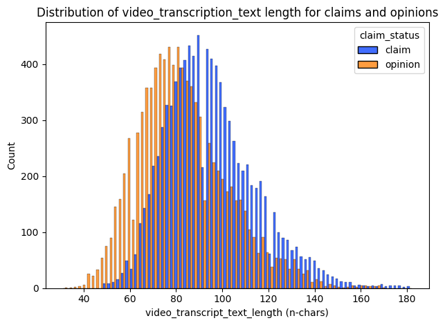
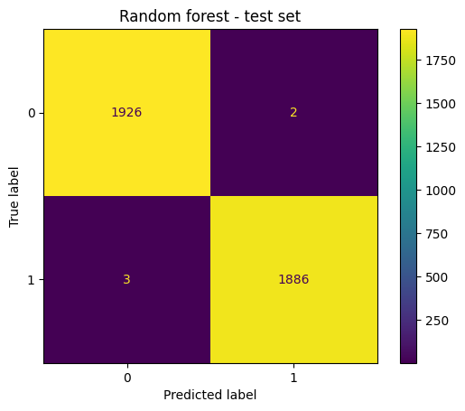
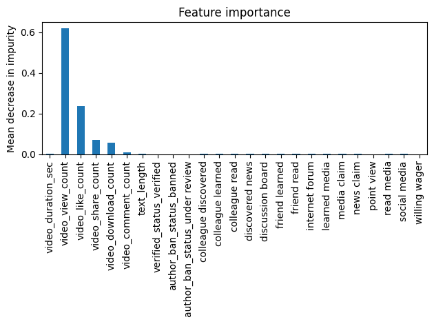

# TikTok Project - Course 6: The Nuts and Bolts of Machine Learning

## Project Overview
The project aims to develop a model to mitigate misinformation on TikTok by predicting whether a video presents a "claim" or an "opinion". This model will help in identifying and managing potentially misleading content on the platform.

## Business Understanding
TikTok users can report videos suspected of violating the platform's terms of service, but the high volume of daily uploads makes it impractical for human moderators to review all reported content individually. 
The TikTok team needs an classification model to help human moderators by identifying and prioritizing `claims`, videos most likely to violate terms of service.

## Data Exploration

The dataset consists of approximately 20,000 TikTok videos with the following features:

- **`claim_status`**: Indicates whether the video presents a "claim" or an "opinion".
- **`video_id`**: Unique identifier for each video.
- **`video_duration_sec`**: Length of the video in seconds.
- **`video_transcription_text`**: Text transcription of the video's audio.
- **`verified_status`**: Indicates if the video creator is a verified user.
- **`author_ban_status`**: Indicates if the video creator has been banned.
- **`video_view_count`**: Number of views the video has received.
- **`video_like_count`**: Number of likes the video has received.
- **`video_share_count`**: Number of times the video has been shared.
- **`video_download_count`**: Number of times the video has been downloaded.
- **`video_comment_count`**: Number of comments on the video.
- **`text_length`**: Length of the transcription text.

Feature distributions and outliers were explored in debth in EDA. 
There is no class imbalance in the target variable `claim_status`. 
Based on EDA we expect features related to engagement to be important predictors.
Prior to modeling the text length distributions of claims vs opinions were visualized.

## Modeling and Evaluation
Two models were evaluated to classify `claim_status`, with the Random Forest model emerging as the champion based on its performance metrics, outperforming XGBoost.
The dataset will be split into 60% for training, 20% for validation, and 20% for testing.

### Random Forest Champion Model

This **Random Forest** model is designed to classify `claim_status`. The best parameters identified through hyperparameter tuning are as follows:

- **`n_estimators`**: 200
  - Number of trees in the forest.
- **`max_depth`**: None
  - Maximum depth of each tree (unlimited depth).
- **`max_features`**: 0.6
  - Fraction of features to consider when looking for the best split (60% of features).
- **`max_samples`**: 0.7
  - Fraction of samples to draw for training each tree (70% of the dataset).
- **`min_samples_leaf`**: 1
  - Minimum number of samples required to be at a leaf node.
- **`min_samples_split`**: 2
  - Minimum number of samples required to split an internal node.

### Model Evaluation Metrics

Recall is prioritized as the primary evaluation metric to minimize false negatives, ensuring that potentially harmful content violating terms of service is identified and reviewed to maintain platform safety and integrity.
The classification report indicates that the Random Forest model achieved nearly perfect evaluation metrics (>0.95), suggesting potential overfitting.

The confusion matrix (test data) reveals only misclassifications in test set, consisting of 3 false positives and 5 false negatives.

### Feature Importance

The most predictive features were all related to the video's engagement levels, which aligns with prior exploratory data analysis (EDA).

## Conclusion and Recommendations

### Model Limitations

1. **Feature Dependence on Engagement Metrics**
   - **Limited Scope**: The model relies heavily on metrics like views, likes, shares, and downloads.
   - **Changing Patterns**: Performance may vary with shifts in user behavior or platform algorithms.

2. **Content and Context Ignorance**
   - **Lack of Semantic Analysis**: Though the model includes 2-3 grams using CountVectorizer, it doesn't prioritize them.
   - **Contextual Misinterpretation**: High engagement could mislead classification if it’s not related to claims or opinions.

3. **Model Interpretability**
   - **Complexity**: Tree-based models like RF and XGBoost are difficult to interpret.
   - **Explainability Tools**: Use tools like SHAP or LIME for better understanding of model decisions.

4. **Generalizability to New Data**
   - **Overfitting**: The high evaluation metrics suggest possible overfitting.
   - **Temporal Relevance**: Performance may decline over time with new content types.
   - **Trend Adaptation**: Regular retraining with updated data is necessary.

5. **Potential Biases**
   - **Unintentional Bias**: The model may skew predictions towards highly engaged content.

### Actions to Address Limitations

- Expand feature sets beyond engagement metrics.
- Improve content analysis using pre-trained language models or ensure effective utilization of n-grams.
- Enhance model interpretability with explainability tools like SHAP or LIME.
- Monitor and update the model regularly to adapt to new data and trends.

